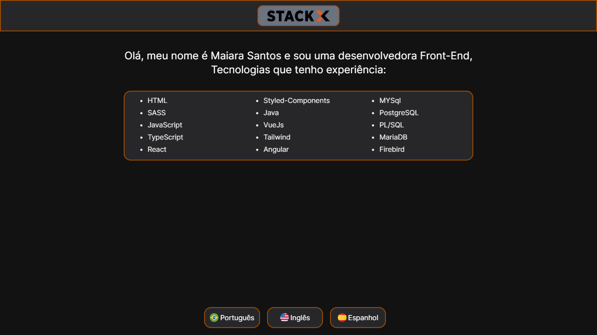

<div align="center">
 
 # DESAFIO WEB 3.0 STACKX

</div>

 Trago-lhe aqui três Projetos que faz parte do Módulo Web 3.0 do curso para `Desenvolvedor Full Stack da Editech StackX`. O conceito destas aplicações, serão três Single Page Aplication, aplicadas em <i>`React`,`Angular`,`Vue.js`</i>. Cada uma foi estruturada dentro de suas particularidades e seus conceitos utilizados conforme 
a demanda dos Frameworks, Bibliotecas e Linguagens manuseadas.A intenção da construção destes Projetos será uma lista com as tecnologias a qual tem experiência, onde será feito um array no HTML e a inserção de um map para listar. Ao clicar no botão de linguagem o texto de apresentação ”Olá meu nome....” mudará para a linguagem selecionada. O botão de linguagem deve ser um componente onde passará 3 propriedades: Título, ícone e o click dele. Estarei apresentando aqui o terceiro Projeto feito em Vue. 

***

 # Entendendo sobre o conceito Vue
  
 Vue (pronuncia-se /vjuː/, como view, em inglês) é um framework progressivo para a construção de interfaces de usuário. Ao contrário de outros frameworks monolíticos, Vue foi projetado desde sua concepção para ser adotável incrementalmente. A biblioteca principal é focada exclusivamente na camada visual (view layer), sendo fácil adotar e integrar com outras bibliotecas ou projetos existentes. Por outro lado, Vue também é perfeitamente capaz de dar poder a sofisticadas Single-Page Applications quando usado em conjunto com ferramentas modernas e bibliotecas de apoio.
 
#  Desafio 03 Vue
 
  Esta aplicação foi construida em `Vue JS`, utilizando a plataforma `Vitets` que é um bundler, onde consegue usar compiladores e frameworks direto  da caixa, além da criação de hot module e replacement dentro do Projeto. O Vue JS será estruturada de aplicações que são constituídas de componentes criados com a sintaxe HTML, CSS e Javascript em um único arquivo vue, que facilita o isolamento e a manutenção de funcionalidades. Cada componente constitui um escopo isolado dos demais, tanto em lógica quantos nos estilos. A renderização dos dados é feita baseada em um virtual DOM que é atualizada apenas quando os dados de um componente são alterados, aumentando o desempenho e descartando atualizações desnecessárias.

<br>
  
  ### <div align="center"> [Clique aqui para acessar o Projeto](https://projeto-03-web-vue.vercel.app/)
   
   ***
   
    
   
   ***
 
 #  Passo a Passo da contrução do Projeto
 
 ###   Instalando o npm no Sistema Operacional
 
 - ```npm install --global``` é uma ferramenta de linha de comando que ajuda a interagir com plataformas online, com navegadores e servidores.
 
 #

  
 ###  Instalando o CLI da Vue

- ```yarn global add @vue/cli```, fornece uma lista de configurações do Esboço que podemos usar, para facilitar a criação de aplicações com Vue. Estes conceitos  permitem configurar ferramentas como: TypeScript, Linting, Testes e Vue-Router.

#

###  Criando o Projeto Vue

- ```vue create```, instalará configurações e pacotes necessários para a execução do Programa, como também poderá funcionar como uma estrutura de aplicativo Web, capaz de alimentar funcionalidades avançadas de uma única página.

#

### Abrir o Projeto no Terminal
   
- ```code .```, Aplicar este comando no PowerShell para ter acesso ao Projeto no VsCode.

#

###  Atualizar a Package
   
- ```npm update -g @vue/cli.```, Irá  atualizar todas as páginas, pacotes, dependências, configurações existente no Projeto.

#

###  Efetuar o Projeto no servidor
   
- ```yarn serve .```, Irá abrir o Projeto no navegador, ele rodará na porta local http://localhost:8080/ , sendo o endereço principal para sua navegação.

#

###  Instalação do PostCSS
   
- ```yarn add -dev tailwindcss postcss autoprefixer vite```, verifica todos os arquivos HTML, components, JavaScript e quaisquer outros modelos para nomes de classe, gerando os estilos correspondentes e em seguida gravando um arquivo css estático.

#

###  Instalando Tailwindcss init
   
- ```npx tailwindcss init```, irá formar um arquivo de configuração do Tailwind, além de obter a estrutura css do utilitário, se concentrando na funcionalidade do item que está sendo utilizado.

#

###  Instalação da Vuex
   
- ```npm install vuex @next --save```, será um padrão de gerenciamento de estado + biblioteca para aplicações Vue.JS, servindo como store centralizado para todos os componentes em uma aplicabilidade com regras, garantindo que o estado só possa ser multado de forma previsível.

#

###  Entendendo o conceito de Babel
   
- `Babel.config` é um transpilador JavaScript, com um código ES2015, que é a versão atual de JavaScript, deve utilizar o transpilador para converter o código novo e gerar, assim, um novo código em ES5, que é uma versão antiga do JavaScript. Essa mudança de código torna-o compreensível para o navegador, permitindo a continuidade dos trabalhos. Entre as suas vantagens estão: ter código aberto e ser multiplataforma; permitindo assim o acesso fácil de todo desenvolvedor que precisa fazer essa alteração. 


